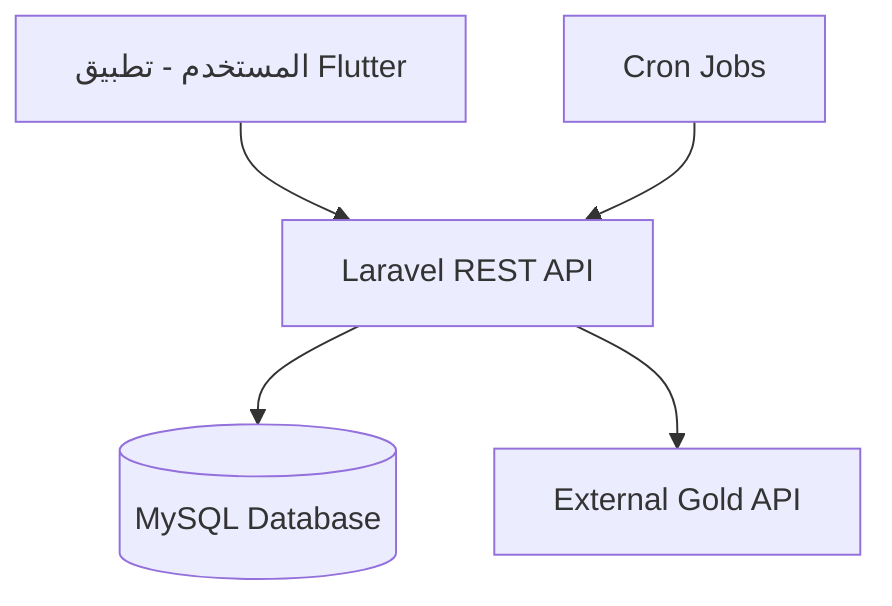

<div align="center">

# 🥇 منصة تتبع أسعار الذهب والسبائك
### Gold Prices & Bullion Tracking Platform

[](https://laravel.com)
[](https://flutter.dev)
[](https://mysql.com)

**نظام متكامل وعالي الأداء لتتبع أسعار الذهب الخام، السبايك، والعملات الذهبية.**

</div>

---

## 🎯 الرؤية
بناء منصة عربية احترافية توفر أدق الأسعار اللحظية مع معادلات تسعير ذكية، مصممة خصيصاً للعمل بكفاءة فائقة على **الاستضافات المشتركة**.

---

## 🚀 المميزات الرئيسية
| الميزة | الوصف |
| :--- | :--- |
| 🔄 **تحديثات آلية** | جلب بيانات الأسعار عالمياً كل ساعة. |
| 🧮 **محرك تسعير ذكي** | حساب لحظي شامل (مصنعية + دمغة + كاش باك). |
| 📱 **تجربة سلسة** | تطبيق Flutter يدعم الـ Offline Caching. |
| 📈 **تحليلات بيانية** | رسوم بيانية تفاعلية لحركة السوق. |
| 🔔 **تنبيهات ذكية** | إشعارات عند الوصول للأسعار المستهدفة. |

---

## 🏗️ المعمارية التقنية


---

## 📂 خريطة الوثائق (Docs Index)
يمكنك الوصول لكافة التفاصيل الفنية عبر المجلد `/docs`:

- 📜 **[المتطلبات (PRD)](docs/01-product/prd.md)**
- 📐 **[المعمارية التقنية](docs/02-architecture/system-architecture.md)**
- 💾 **[تصميم قاعدة البيانات](docs/03-database/erd.md)**
- 🧮 **[محرك التسعير](docs/04-pricing-engine/formulas.md)**
- 🔗 **[واجهات الـ API](docs/05-api/api-design.md)**

---

## 🛠️ البدء في التطوير
للبدء، اتبع هذه الخطوات البسيطة:

1. **إعداد قاعدة البيانات:**
   ```bash
   # استيراد ملف الهيكلية
   mysql -u root -p gold_db < docs/03-database/schema.sql
   ```
2. **تجهيز الخلفية:**
   ```bash
   composer install
   php artisan migrate
   ```
3. **تطوير المهام:**
   راجع المهام المحددة في **[نظام المهام](docs/11-tasks/task-1.md)** للبدء فوراً.

---

## 🛡️ الأداء والأمان
- **أمان:** حماية عبر `Laravel Sanctum`.
- **أداء:** نظام `Caching` متطور لتقليل الضغط على السيرفر.
- **توسع:** هيكلية قابلة للتوسع لدول وعملات متعددة.

---

<div align="center">
  <sub>تم تطوير هذا المشروع بمعايير هندسية تضمن الأداء والاستقرار.</sub>
</div>
